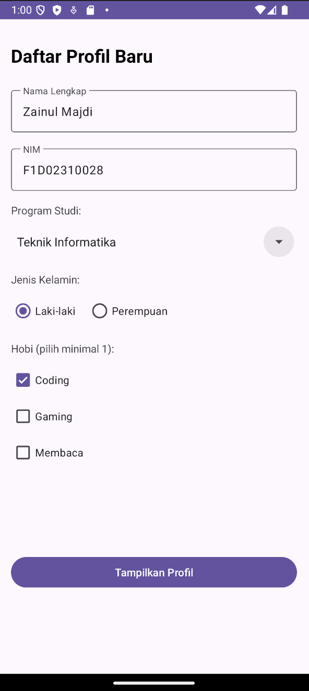
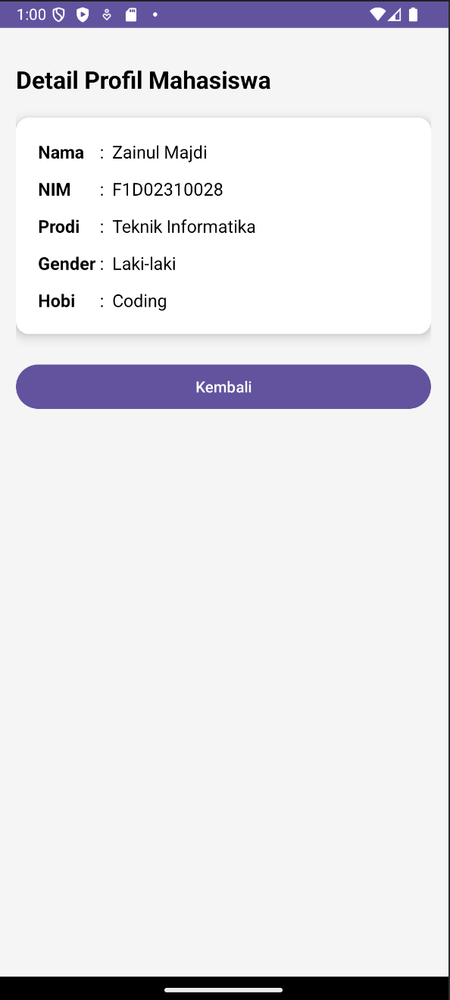

# Tugas 3: Aplikasi Profil Mahasiswa (Intent & Parcelable)

##Link github : https://github.com/M47d1/Tugas3-Pember.git

Aplikasi Android sederhana yang dibuat untuk memenuhi Tugas 3 mata kuliah Pemrograman Mobile. Aplikasi ini mendemonstrasikan perpindahan data antar-Activity menggunakan konsep **Explicit Intent** dan **Parcelable**.

## 📝 Penjelasan Umum
Aplikasi ini terdiri dari dua halaman utama:
1. **Main Activity (Halaman Form):** User memasukkan data diri berupa Nama, NIM, Program Studi, Jenis Kelamin, dan Hobi. Input NIM dikonfigurasi agar dapat menerima karakter alfanumerik (huruf dan angka).
2. **Profile Activity (Halaman Detail):** Menampilkan data yang dikirim dari halaman pertama secara rapi menggunakan `TableLayout` di dalam `CardView`. Data dikirim dalam bentuk objek model `Mahasiswa` yang mengimplementasikan interface `Parcelable` untuk efisiensi performa.

## 🚀 Fitur Utama
- **Data Passing:** Mengirim objek kompleks (Parcelable) antar activity.
- **Dynamic Layout:** Penggunaan `TableLayout` untuk memastikan tampilan detail profil simetris (titik dua sejajar).
- **Navigation:** Tersedia tombol kembali (Back Button) di ActionBar dan tombol manual untuk memudahkan navigasi user.
- **Input Validation:** Input NIM yang fleksibel (mendukung teks dan angka).

## 📸 Screenshots
Berikut adalah tampilan aplikasi saat dijalankan:

| Halaman Form (Input) | Halaman Profil (Output) |
| :---: | :---: |
|  |  |

## 🛠️ Teknologi yang Digunakan
- **Bahasa:** Kotlin
- **UI Layout:** ConstraintLayout, TableLayout, CardView
- **Framework:** Jetpack (AppCompat)
- **ID Passing:** Parcelable implementation

---
*Dibuat oleh: Zainul Majdi (Semester 6 - IT)*
